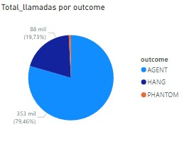

# Trabajo Call Center

En este trabajo vamos a ver algunos informes que obtuvimos mientras estabamos investigando y responder algunas preguntas que nos plantearon.

# ¿Cuál es el nivel de servicio para los clientes Prioritarios? 

Como se puede ver en la gráfica, el nivel de servicio para los clientes prioritarios es poder llamar sin tener un tiempo de espera significativo. Ya que al ser prioritarios no tiene sentido que demoren en una llamada.

# ¿Qué volumen de llamadas atendemos? 

El volumen total de llamadas es de 444 mil llamadas. Es un número considerablemente alto y eso nos llena de orgullo porque quiere decir que nuestro servicio es realmente utilizado.

# ¿Cuáles son los cuellos de botella? ¿En qué días? ¿En qué bandas horarias?

Como se puede observar en la primera imágen, los primeros días de semana son los días en donde más se realizan llamadas y creemos nosotros que es por la actividad laboral en esos días al igual que los horarios, que donde más se llama es aproximadamente a las 15 horas debido que en muchos lugares es horario de cierre.

# ¿Cómo es la eficiencia y productividad de nuestros agentes?

En esta imagen se demuestra el uso de los agentes que prestan el servicio. Se puede demostrar que AGENT como HANG son de lo más utilizados ya que son los mejores servicios.

# ¿Cuáles son los tipos de servicio más recurrentes?

En este gráfico se puede ver cuales son los servicios que más escogen los usuarios.

# ¿Podemos estimar la dotación necesaria para cumplir con una calidad de servicio determinada? Ejemplo: si quiero que mi tiempo promedio de espera sea menor a 60 segundos?

Nosotros creemos que no hace falta ya que incluso el promedio de espera es menor a los 60 segundos que se establece.

